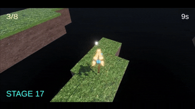

# 概要
ランダム生成される島を飛び回りながら、時間内に全部のキューブを集めて次のステージに進むゲーム。製作期間6日 
UNITYで作成。操作方法：WASDで移動、SPACEでジャンプ

ダウンロードはこちらhttps://github.com/sena654g/Islands/releases/tag/%E3%81%82
Islands.exeを開いてゲームをプレイできます。終わりたいときはウィンドウを閉じてください。

